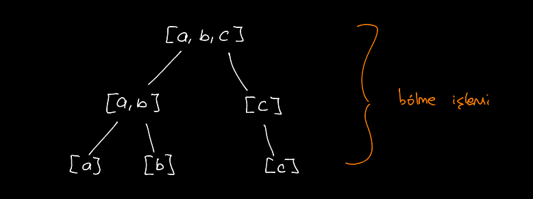
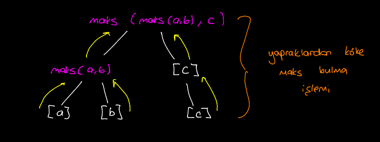
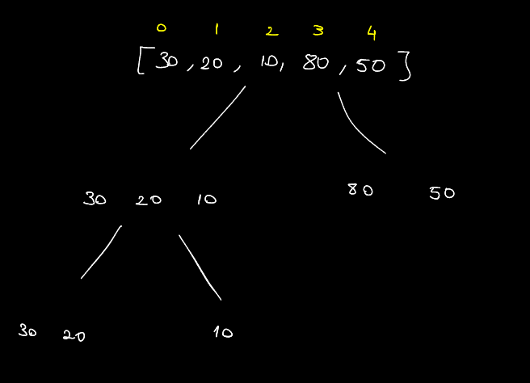
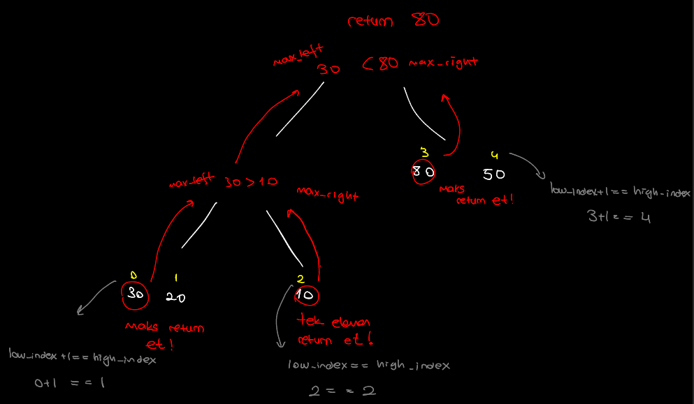

# Balanced Recursion Tree

Divide and conquer (böl ve yönet) mantığını kullanır.

- Dizi tam ortadan bölünmeye başlar. Eleman sayısı 1 veya 2 değilse kendi içerisinde tekrar bölünür.
- Eleman sayısı 1 ise kendisini yukarıya döndürür.
- Eleman sayısı 2 ise büyük olan kendini yukarıya döndürür.
- Alt dizilerden gelen sayılar karşılaştırılarak büyük olan döndürülür.
- Ana dizinin olduğu kısıma kadar döndürülen sayı maksimum sayıdır.

Yukarıdaki resimde gördüğünüz gibi dizinin elemanları ikiye bölünerek yaprakları oluşturur.

Daha sonra dizi sayısı 2 olan yaprakta büyük olan bir üste döndürülür (return). dizi sayısı 1 olan ise kendisini döndürür.

Bir yukarıdaki seviyede ise bu döndürülen elemanlardan büyük olan döndürülür (return edilir).

Bu yinelemeli (recursive) yapı ile maks olan eleman bulunur.

## Örnek

5 elemanlı bir dizimiz olsun : `[30,20,10,80,50]`

Dizinin ağaç şeklini çizelim:

Görildüğü gibi 2 eleman veya 1 eleman kalınca bölme (divide) işlemi durur.

Şimdi ise düğümlerden köke kadar karşılaştırma yaparak Maks olan elemanı bulalım:

Sarı ile yazılanlar indis sayısıdır.

 Alt dizilerde `low_index ile high_index birbirine eşitse `tek elemanlı bir dizi olduğunu anlarız.

Eğer `low_index + 1 high_index'e eşitse` iki elemanlı bir dizi olduğunu anlarız.

---

> Balanced Recursion Tree C kodu için [bu](./balanced_recursion_tree.c) dosyaya bakabilirsiniz. (çalıştırmak için dizine gidip make run yazınız)

