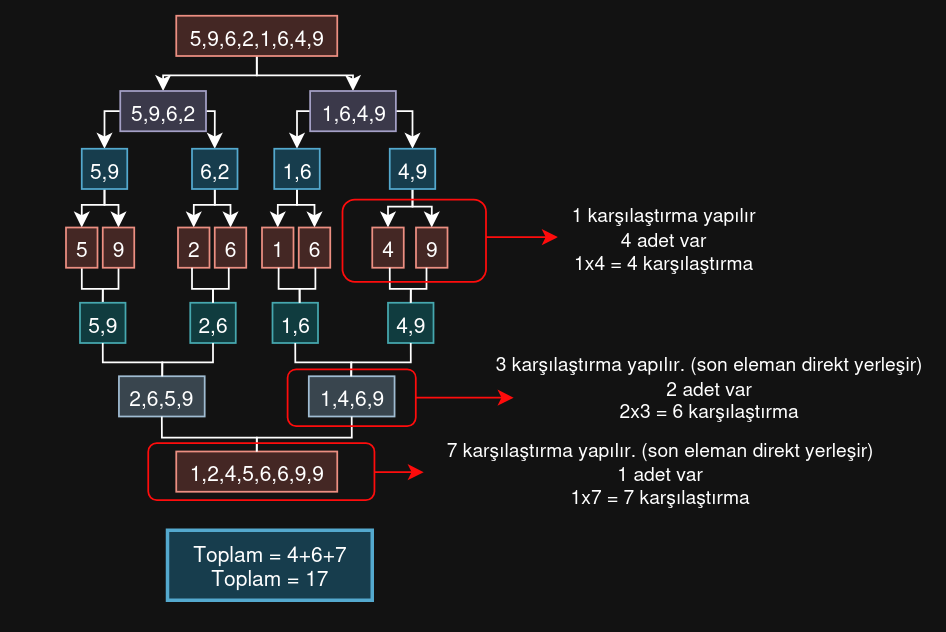
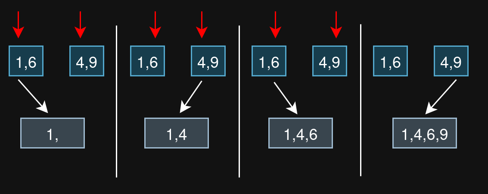

# Merge Sort

Divide and conquer (böl ve yönet) mantığını kullanır.

- Diziyi her defasında ikiye bölerek işlemleri yaparız. Bu bölme işlemi kıyaslanacak eleman sayısı 1'e gelesiye kadar devam eder.
- Her bölünmüş parçayı tekrar birleştirirken elemanları sıralı tutmak için tekrar bir karşılaştırma yaparız.

## Örnek


Resime bakarak tek tek analiz edelim.

- Bu örnekte `N = 8` olduğunu görebilliriz.
- İlk olarak `log(N) = 3` sonucundan, 3 aşamada tek elemanlı hale geliriz.
- Daha sonra her bir elemanı karşılaştırıp birleştiririz.
- Birleştirilmiş olan 2li elemanları da tekrar karşılaştırıp birleştiririz.
- 4lü elemanları da karşılaştırıp birleştiririz. 
- Sonuçta elimizde `sıralanmış` bir dizi vardır.

**Algoritma analizini çıkaralım.**


Her defasında 2'ye bölerek tek elemana ulaşırız. Kaç adımda tek elemana ulaştığımızı `k` ile ifade edelim. Resimdeki örnek için `N=8`elemanlı bir dizide tek elemana ulaşmak için 3 kere ikiye bölme işlemi yapılır.

`k = log2(N)` formülü ile bunu bulabiliriz. Aslında bu `k` değeri bize kaç defa merge (birleştirme) yapacağımızın değerini verir. Bu değer ile her bir adımda kaç adet karşılaştırma yaptığımızı çarparsak toplam karşılaştırma sayısını buluruz.



Resimde göründüğü gibi her bir merge işleminde `eleman sayısı - 1` kere karşılaştırma yapılır. Mesela 2 adet 1 elemanlı diziyi 1 kere karşılaştırırz. 2 adet 2 elemanlı diziyi ise 3 kere karşılaştırırız.

[1,6] ve [4,9] karşılaştırmasına bakalım:



#### Resimdekileri adım adım açıklayacak olursak:

- ilk olarak 1 ile 4 karşılaştırılır, 1 yerleştirilir, ilk dizinin indisi artırılır
- daha sonra 6 ile 4 karşılaştırılır, 4 yerleştirilr, ikinci dizinin indisi artırılır
- 6 ile 9 karşılaştırılır, 6 yerleştirilir.
- son kalan eleman direkt yerleştirilir,

Bu merge işleminde `4 adet eleman` var, yapılan karşılaştırma `4-1 = 3`'tür.

```bash
merge işlemindeki karşılaştırma sayısı = eleman sayısı - 1;
```


#### N = 8 için şu çıkarımı yapabiliriz.

- ilk birleştirmede 4 karşılaştırma      => 8-4 = 4
- ikinci birleştirmede 6 karşılaştırma   => 8-2 = 6
- üçüncü birleştirmede 7 karşılaştırma   => 8-1 = 7
- Sonuç                                  =  N.log2(N) -7 = 17

-7 ifadesini de N'e bağlı bir şekilde yazarsak:
```bash
N.log2(N)-N + 1 = Toplam karşılaştırma sayısı
```

Formulünü buluruz. Merge Sort'da en iyi ve en kötü durumda karşılaştırma sayısı hep aynıdır. Bundan dolayı `optimum` algoritma denir.

## Sonuç

N sayısı küçük olursa `-N+1` ifadesi toplam karşılaştırma sayısı için önemlidir. Eğer N sayısını uçuk bir değer alırsak büyüme hızı ihmal edilebilir hale gelir.

Sonuç olarak `Merge Sort` için 

```bash
N.log2(N) = Toplam karşılaştırma sayısı
```
Formulü kullanılır.

---

> Merge Sort C kodu için [bu](./merge_sort.c) dosyaya bakabilirsiniz. (çalıştırmak için dizine gidip make run yazınız)

> Büyüme hızı farkını merak ediyorsanız [bu](./calc_different.py) python dosyasını çalıştırarak analiz edebilirsiniz.


