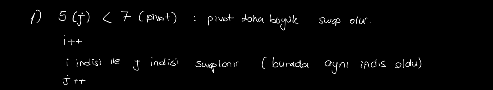
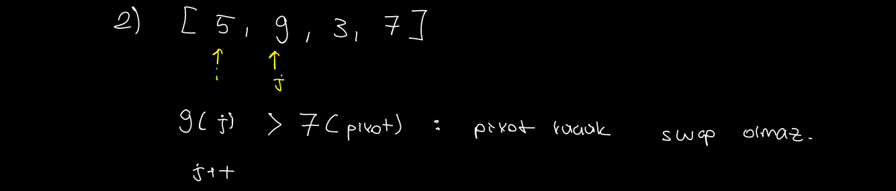
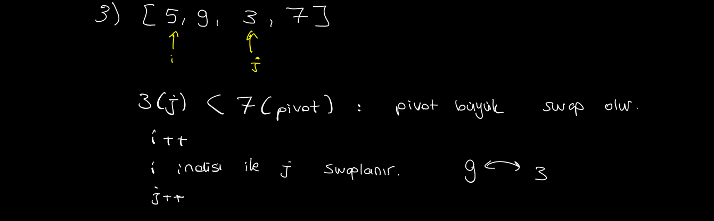
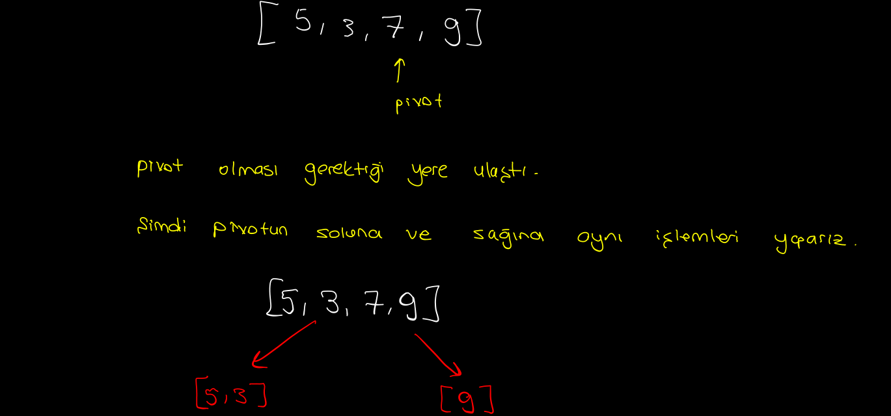
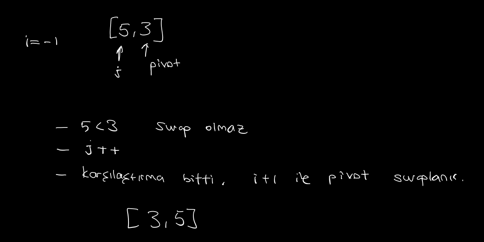
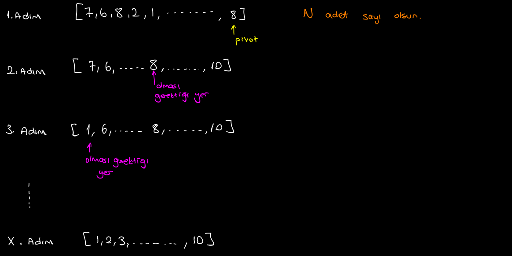
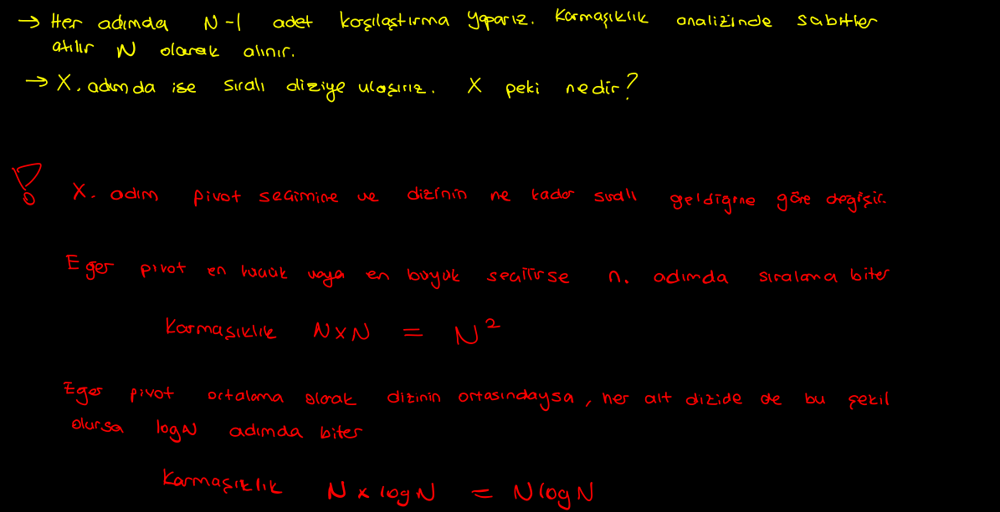

# Quick Sort

Divide and conquer (böl ve yönet) mantığını kullanır.

- Dizide ilk olarak pivot seçilir.
- Dizi baştan sona taranır. Pivottan küçük olanlar pivotun soluna, pivottan büyük olanlar pivotun sağ tarafına yerleştirilir.
- En son ise pivot olması gereken yerine yerleştirilir.
- Dizi pivottan olmak üzere sağ ve solda iki diziye ayrılır (divide)
- Bu adımlar dizide 2 veya 1 eleman kalasıya kadar tekrar edilir.

# Örnek 

Elimizde sıralanmayı bekleyen [5,9,3,7] dizisi olsun

- `Lomuto partition`'a göre pivotu en sağdaki eleman seçtik.
- i pivottan küçük sayıların en büyüğünü tutan indistir. Şu an -1 çünkü sıralamaya başlamadık.
- j indisi de diziyi gezecek olan indistir. şu anda 0.

Adım adım sıralamaya bakalım şimdi:

Dizide 5 ile 7 karşılaştırılır. Pivot j indisinideki elemandan büyük olduğundan swaplanır. Swaplanmadan önce i indisi artırılır. Bu örnek için i ve j aynı indis oldu.

swap işleminden sonra j artırılır.

Dizide 9 ile 7 karşılaştırılır. Pivot j indisindeki elemandan küçük olduğundan swap gerçekleşmez.

j artırılır

3 ile 7 karşılaştırılır. Pivot j indisindeki elemandan büyük olduğundan swaplanır.

swaptan önce yine i artırılır.

swaptan sonra j artırılır.

En sonda karşılaştırma biter (dizinin sonuna ulaştık). i+1 ile pivot swaplanır. Böylece `pivot` artık dizide olması gereken yerine ulaşmış olur.

Evet ilk adım gerçekleştirilmiş oldu. Şimdi ise pivotun sağında ve solundaki elemanları kendi içerisinde pivot seçilerek tekrar karşılaştırmaya alırız.

Sağ kısımdaki zaten tek eleman olduğu için bir işlem yapılmaz.

Sol kısımda ise 5 ile 3 karşılaştırılır. Pivot küçük olduğundan swap olmaz ve j++ ile 1 olur.

Karşılaştırma bittiğinden dolayı da i+1 ile pivot swaplanır. (5 ile 3).

Sonuç olarak : `[3,5,7,9]` dizisine ulaştık.

## Sonuç

Her adımda N adet sayıyı karşılaştırıyoruz. Ve bu karşılaştırmayı X adım yapıyoruz. Neden `X` dedim. Çünkü adım sayısı seçilen pivot'a göre değişir.

Eğer pivotu dizinin en büyük veya en küçüğü olarak seçersek gereksiz bir sonraki adımda dizi en sağdan veya en soldan ikiye bölünecektir.

Eğer pivot tam ortadan seçersek bir sonraki adımda dizi ortadan bölünecektir.

Buradan çıkarılacak sonuçla algoritmanın zaman karmaşıklığını şu şeklilde söyleyebiliriz:

- **Best Case: (Ω(n log n))**: Pivot diziyi tam ortadan bölecek şekilde seçilirse
- **Average Case (θ(n log n))**: Pivot tam ortadan olmasa da ortalarda bölecek şekilde seçilirse
- **Worst Case: (O(n²))**: Pivot dizinin en küçüğü veya en büyüğü seçilirse.

---

> Quick Sort C kodu için [bu](./quick_sort.c) dosyaya bakabilirsiniz. (çalıştırmak için dizine gidip make run yazınız. Linux için)